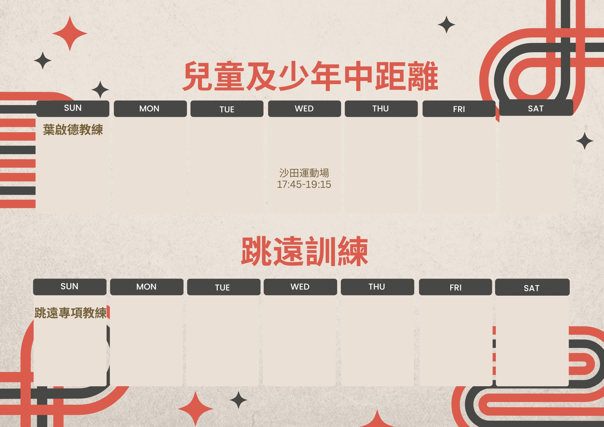

### 「第一屆新星精英田徑錦標賽」(第二站)（26-05-2023）

比賽日期：26/5/2023(佛誕假期)

地點：灣仔運動場（電子計時）

年齡：2011-2019

#### [按此報名 - 「第一屆新星精英田徑錦標賽」(第二站)（26-05-2023）參賽線道和時間表(update)](https://drive.google.com/drive/folders/1kIRy5FwBsnQSfDLKsGM0u8zZOzDCaFLr)
--------------------------------------------------------------------------------------
### 「新星青少年暑期田徑訓練2023」

訓練於七月中至八月底舉行，課程由總教練葉啟德策劃，訓練內容包括：熱身拉筋、跑之專門技術、起跑及反應跑、爆發力及速度耐力等；訓練專業非遊戲活動，為秋季一系列學界及分齡賽作「準備期」之訓練。除了中、小學之外，亦歡迎幼兒（K1-K3）參加，學習基礎跑步技術及正確跑姿，為未來跑得更遠作準備。
 
訓練詳情：
地區：沙田、馬鞍山、屯門、青衣、香港仔、銅鑼灣、巴富街、天水圍、斧山道、深水埗、九龍灣、將軍澳、葵涌

日期：2023年7月22日開始至8月23日

### [按此報名：我想參加訓練!](https://forms.zohopublic.com/hknovasports852/form/2023/formperma/vP4YTxMm-d-aEsZzpJITD3XdYib-HY7aGup6AF0QqbY )
---------------------------------------------------------------------------------------

### 「第二屆新星幼兒室内田徑錦標賽」比賽報名

歡迎2015-2019小朋友參加，跑項賽事在有蓋場地進行，不用日曬雨淋，家長可以近距離觀戰打氣，比賽氣氛刺熱，給幼兒增加比賽經驗，了解進度。

主辦機構：新星田徑會

協辦機構:香港基督教青年會京士柏百周年紀念中心

比賽日期: 2023年7月1日（回歸假期）

比賽時間：09:00-14:00

比賽地點：香港基督教青年會京士柏百周年紀念中心（佐敦）

### [按此報名：0701第二屆新星幼兒室内田徑錦標賽 - 報名](https://forms.zohopublic.com/hknovasports852/form/01072023/formperma/CmX53FfmWwtZ8YxsBxyyXGs_pFnkzcXqMa5LIxv480M)
---------------------------------------------------------------------------------------
### 沙田體育會「夏季田徑專項訓練班2023」

課程目標：訓練以學習正確跑步或跳遠技術為主，循序漸進， 作出針對性的訓練，以學界比賽、分齡賽、區際比賽為目標。
教練均為前港隊或精英運動員，具多年兒童及青少年田徑教學經驗。
訓練時段為沙田體育會租用時段，可使用沙池訓練。
 
對象：5-18 歲兒童及少年
 
費用：全期$900，共九堂
 
日期：4/5, 11/5, 18/5, 1/6, 8/6, 15/6, 29/6, 6/7, 13/7 （逢星期四）
 
時間：17:30-19:00
 
地點：沙田運動場

### [按此報名：我想參加訓練!](https://zfrmz.com/VQmnUbYTzkMJySfX9K0s)
---------------------------------------------------------------------------------------
### 「沙田復活節田徑大獎賽2023(Day One)」（05-04-2023) 幼兒及小學組 比賽時間表及分場線道公佈

地點：馬鞍山運動場

#### [按此瀏覽 - 0405沙田復活田徑大獎賽2023第一站 - 成績](https://drive.google.com/drive/folders/1l4k1xc9pjHdYXGL07hdXB8ycQplGwRVT?usp=share_link)
#### [按此瀏覽 - 0405沙田復活田徑大獎賽2023第一站 - 補購證書](https://zfrmz.com/KE22vJkXjl8q5ahuydvq)
---------------------------------------------------------------------------------------
### 「沙田復活節田徑大獎賽2023(Day Two)」（10-04-2023）中學、公開及常青組 

地點：馬鞍山運動場（電子計時）

組別：
2004-2010（中學ABC組）、1989-2003（公開組）、1988-1938（常青組）

#### [按此瀏覽 - 沙田復活田徑大獎賽Day 2_成績](https://drive.google.com/drive/folders/1hFKlp-ZzD-qjEyIYAjQ4vXtPi-6uLrn-?usp=share_link)
#### [按此瀏覽 - 沙田復活田徑大獎賽Day 2_補購證書](https://zfrmz.com/kxCSisOnXoBDS15yIH24)

--------------------------------------------------------------------------------------
### 「第一屆新星精英田徑錦標賽」(第一站)（10-04-2023）

比賽日期：10/4/2023（復活節假期）

地點：灣仔運動場（電子計時）

年齡：2011-2019

#### [按此瀏覽 - 第一屆新星精英田徑錦標賽」(第一站)（10-04-2023）成績](https://drive.google.com/drive/folders/1d7FXDdFlkrBetIJEzHZCKI4Dp594ZWyI)
#### [按此瀏覽 - 第一屆新星精英田徑錦標賽」(第一站)（10-04-2023）補購證書](https://zfrmz.com/jVMAekCE6Mvx8bHGaFl1)
#### [按此瀏覽 - 第一屆新星精英田徑錦標賽」(第一站)（10-04-2023）相片](https://photos.google.com/share/AF1QipPGWCWr3cvZeeoMHgEozbeD_SCQ7fK-zJGVTup6SwGgAPlsT1bzqHeqTHGfGF4UDw?key=c01QSXZXWjQwN0NfV19GaEhQZmpLSlBXMml4Qkt3)

--------------------------------------------------------------------------------------
### 「新星中長跑訓練課程」
 
備戰渣馬，從今日開始！
長跑需要系統訓練，了解自己、了解訓練安排會事半功倍；課程目的是訓練之餘，亦學習為自己編制每個階段的訓練計劃，不只是跟教練安排而跑，備戰今年底的「渣馬2023」及其他海外賽事。
 
課程時間：逢星期三 19:15 - 20:45 （訓練課)
星期日 13:45 - 15:15 （理論及技術課，附教材）
 
地點：沙田運動場
 
日期：訓練課 1/3、8/3、15/3、22/3、29/3、19/4、26/4
理論課及技術課 5/3、12/3、19/3、26/3
 
費用：$880（包教材與證書）

查詢及報名：WhatsApp 60661322

---------------------------------------------------------------------------------------

### 「新星田徑會新學年會員大招募」恆常班

疫情漸退，沉靜了的學界比賽季賽即將展開，本會成立一週年，培訓出不少精英，發掘田徑新星，歡迎有興趣學跑步、求突破的小朋友入會參加。訓練以學習正確跑步技術為主，循序漸進，以學界比賽、分齡賽為目標，長線培訓學員爭取入港隊，代表香港出賽的機會。教練多為前港隊或精英運動員，課程由總教練葉啟德策劃安排，於全港各區也有訓練點，歡迎幼兒、兒童及少年報名參加訓練班。

### [按此報名：我想參加訓練!](https://docs.google.com/forms/d/e/1FAIpQLSc0tj2-QdYfK6X0CYiP3YE_-hFovM_tXoF4Q6bDWyMzEmNgsg/viewform)

---------------------------------------------------------------------------------------
### 「沙田體育會田徑專項訓練班」

一個推廣田徑運動及難得的專項跳遠訓練班，收費普級化，全期十堂$1000，教練經驗豐富，歡迎小學至初中同學參加
### [按此報名 - 「沙田體育會田徑專項訓練班」](https://forms.zohopublic.com/hknovasports852/form/2022111/formperma/HGa-91QrxUa0dqjr7ewAwZD6ulJDnFTWRxZKrhiEuxc )
---------------------------------------------------------------------------------------
### 「新星春季幼兒田徑錦標賽」/「全港小學學界賽前測試」（12-02-2023）成績公佈
### 地點：YMCA烏溪沙青少年新村田徑場

#### [按此瀏覽 - 新星春季幼兒田徑錦標賽(12-02-2023) 全場總冠軍](https://drive.google.com/file/d/172llR-kuQNys0EFqi--BVuylWmHpukeD/view?usp=share_link)
#### [按此瀏覽 - 新星春季幼兒田徑錦標賽/ 全港小學學界賽前測試(12-02-2023) 成績公佈](https://drive.google.com/drive/mobile/folders/1uBUjQlfPKnaHUKhi5eI1u48vZTnRLz5G)
#### [按此瀏覽 - 新星春季幼兒田徑錦標賽/ 全港小學學界賽前測試(12-02-2023) 聖心影攝影學會Dickson義務拍照](https://photos.google.com/share/AF1QipO-mI_I1j_KsG3GhdbEGf9TAX9SobNO4yP3bUEPEBO_tJuPQhQAdx4Leqgb2TVTXA?pli=1&key=U1dXN0R4VGpvQW9zSkhSdVM3bzhyZ05VX2RJTUR3)
---------------------------------------------------------------------------------------
### 「新星幼兒冬日田徑聯賽」成績公佈
#### 2023年1月1日（星期日）第二站：YMCA佐敦京士柏百週年紀念中心有蓋體育場 

#### [按此瀏覽 - 0101冬日聯賽第二站_成績公佈](https://drive.google.com/drive/folders/1Y1gO2U1d0AguuRJXQLcg73rRU4a5Jyq2?usp=share_link)
#### [按此補購證書 - 0101冬日聯賽第二站_補購證書](https://zfrmz.com/o7bcmpEe7XjfOuZLqmnk) 

--------------------------------------------------------------------------------------
### 「第一屆沙田學界田徑之王（第二站）」(08-01-2023)成績公佈

#### [按此瀏覽 - 0108田徑之王(二)成績](https://drive.google.com/drive/folders/1AESnQAi51vdWcLJzhzMTQIoCEQCL3PHc)
#### [按此瀏覽 - 0108田徑之王(二)補購證書](https://zfrmz.com/HYOJ9IG7oeO2ILd2UQw1)

---------------------------------------------------------------------------------------
### 「第一屆沙田學界田徑之王（第一站)」(26-12-2022) 成績公佈

#### [按此瀏覽 - 1226證書補購](https://zfrmz.com/CKUlhUL2VfF8Qyijh2skk)
#### [按此瀏覽 - 1226成績](https://drive.google.com/drive/folders/1TfMGvUbis8mxtsShVg_30DdfjURIhmiD)

---------------------------------------------------------------------------------------
### 「新星幼兒冬日田徑聯賽」成績公佈
#### 2022年12月4日（星期日）第一站：YMCA烏溪沙青少年新村田徑場 
#### [按此瀏覽 - 1204新星冬日聯賽第一站_成績公佈](https://drive.google.com/drive/folders/1vH3ssz6OMG8Gkn1GMbilFoL6TWjZJVcA?usp=share_link)
#### [按此補購證書 - 1204新星冬日聯賽第一站_補購證書](https://forms.zohopublic.com/hknovasports852/form/41220221/formperma/s2itCDCkjPjbAMigptcnCZHOjiV6o1ecL4Y731YC23E)

---------------------------------------------------------------------------------------
### 「第一屆沙田秋季兒童田徑錦標賽」

#### 2022年10月4日 馬鞍山運動場
#### [按此瀏覽：賽事成績公佈](https://drive.google.com/drive/folders/109yS_JjKuu_EWDsWp9hrmWNBKq3YkKvu?usp=sharing)

***多謝鍾曉林家長義務為大家拍攝「沙田秋季田徑賽」比賽花絮照片😎👏👏👏 
[[按此瀏覽：比賽花絮照片]](https://mega.nz/folder/QQAQxJzT#BOKxEnrWBFlq_GYfr4yzBQ)***

---------------------------------------------------------------------------------------
### 沙田慶回歸兒童田徑錦標賽 2022 
#### 9月12日 馬鞍山運動場
 
#### [按此瀏覽：賽事成績公佈](https://drive.google.com/drive/folders/1tWt3CMyD3c5Cpo3XLheEt82CZLyWAvjI?usp=sharing)

---------------------------------------------------------------------------------------
### 第一屆新星週年田徑錦標賽

#### 9月4日 YMCA烏溪沙青年新村 

#### [按此瀏覽：賽事成績公佈](https://drive.google.com/drive/folders/1sS6c8Ys7cMlyjmcAQiND05GWLFbpuxYI?usp=sharing)

---------------------------------------------------------------------------------------

### 教練陳佩琦👩🏽

##### [星島日報報導📰 - 沙田賜我力量](https://drive.google.com/drive/folders/1ngK58f050uDZj7RgVmokHQQTiDBm-nfP?usp=sharing)

##### [信報報導📰 - 短跑美少女「追」夢誓戰亞運](https://drive.google.com/file/d/1NgN3GuMWmGJVSenFJypOgL8vqFuxYApv/view?usp=sharing)

##### [東方日報報導📰 - 女飛人跨越傷患邊讀邊教 陳佩琦振作放膽再衝](https://orientaldaily.on.cc/content/%E9%AB%94%E8%82%B2/odn-20211126-1126_00286_041/%E5%A5%B3%E9%A3%9B%E4%BA%BA%E8%B7%A8%E8%B6%8A%E5%82%B7%E6%82%A3%E9%82%8A%E8%AE%80%E9%82%8A%E6%95%99-%E9%99%B3%E4%BD%A9%E7%90%A6%E6%8C%AF%E4%BD%9C%E6%94%BE%E8%86%BD%E5%86%8D%E8%A1%9D?fbclid=IwAR3tCLKgaWevelE1CkNDt35_h4jvjbahZq-6KdIOuqoGGtac--nebOFVOoU)

##### [東網報導📰 - 推廣開心運動 從社區「起步」](https://hk.on.cc/onad/bkn/cnt/ad/20211115/ad-20211115150906775-1115_21011_001.html)

---------------------------------------------------------------------------------------

### 「努力訓練，初見成果」💪🏻🎉🏆

本會創會三個月，大家經過努力及家長支持後，今日比賽有所收成。

除了蔡承殷在「田總分齡賽」女子U18組800、1500m連奪兩金外，多位新星在「飛達秋季田徑錦標賽」中表現進步，創出佳績，共奪得十三金、九銀、八銅及兩個年份全場冠軍及打破十項紀錄之驚喜成績！（見附表）

其中「小鐵人」Kami梁珈睿打破四項大會紀錄奪女子2012年組全埸冠軍，可說近年最出色的新星；

另一新星2013年的郭君澄除了聯同師姐Kami打破2012年接力紀錄外，自己亦打破兩項個人紀錄奪三金及拿下2013年組全場冠軍；

四百好手鄭芷殷 在女子2010年組100m得金後，半小時內在400米 決賽以1’04”69破紀錄成績奪金；

男子方面，劉昊臨在2010年60m 以8”28 破紀錄獲冠軍。

在此恭喜各位會友，各位每週兩至三次練習及刻苦訓練的付出，才有今日成果，團結是力量，多謝各家長信任，未來希望能尋找更多新星成為香港未來田徑接班人!

[歡迎幼兒至中學生參加 - 訓練班詳情](https://docs.google.com/forms/d/e/1FAIpQLSc0tj2-QdYfK6X0CYiP3YE_-hFovM_tXoF4Q6bDWyMzEmNgsg/viewform)

---------------------------------------------------------------------------------------

### 2021 沙田學界🏃🏻‍♀️🏃🏻

#### [陳柏翹 - 男乙100米勝出](https://drive.google.com/file/d/1YMheR5loAjQaXWFzcw5uuEgBzbf1P9QC/view?usp=sharing) 

#### [Bosco - 男乙200米以31”03 PB勝出](https://drive.google.com/file/d/1BrIfrZuCVbG_EmYVWTK_PSifCoOq3q4B/view?usp=sharing)

---------------------------------------------------------------------------------------
