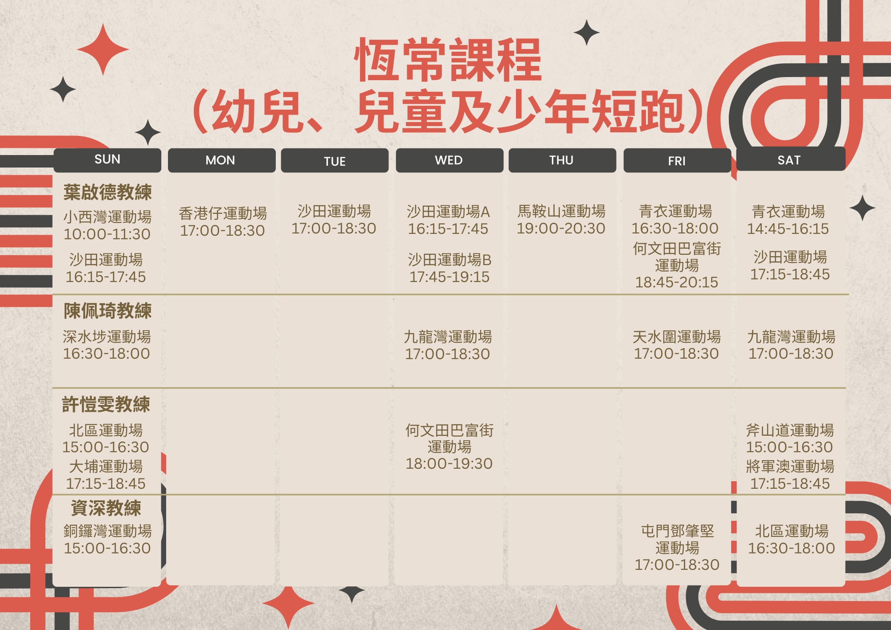

### 「新星田徑會新學年會員大招募」恆常班

疫情漸退，沉靜了的學界比賽季賽即將展開，本會成立一週年，培訓出不少精英，發掘田徑新星，歡迎有興趣學跑步、求突破的小朋友入會參加。訓練以學習正確跑步技術為主，循序漸進，以學界比賽、分齡賽為目標，長線培訓學員爭取入港隊，代表香港出賽的機會。教練多為前港隊或精英運動員，課程由總教練葉啟德策劃安排，於全港各區也有訓練點，歡迎幼兒、兒童及少年報名參加訓練班。

#### [按此報名：我想參加訓練!](https://docs.google.com/forms/d/e/1FAIpQLSc0tj2-QdYfK6X0CYiP3YE_-hFovM_tXoF4Q6bDWyMzEmNgsg/viewform)

---------------------------------------------------------------------------------------
